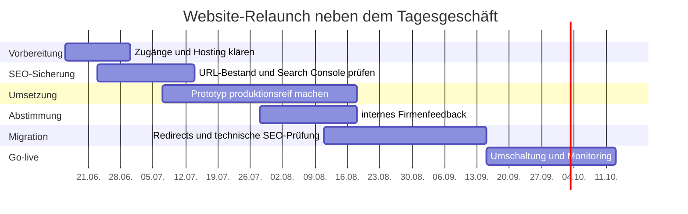

# Folgetermin Website-Relaunch: Kurzfahrplan und SEO-Einordnung

Stand: 15. Juni 2026

## 1. Ziel dieser Kurzfassung

Diese Datei ist die schlanke Gesprächsgrundlage für den nächsten Termin mit
der Geschäftsführung.

Sie ist bewusst weniger detailliert als
`docs/project/folgetermin-website-relaunch.md`. Der ausführliche Fahrplan bleibt
als Nachschlagewerk erhalten. Diese Kurzfassung beantwortet nur die Fragen, die
für den nächsten Termin wahrscheinlich wichtig sind:

- Wie geht es realistisch weiter?
- Was muss entschieden oder organisiert werden?
- Wo entsteht Aufwand?
- Was sind die größten Risiken?
- Wie gehen wir mit SEO um, damit die neue Website nicht schlechter, sondern
  langfristig besser wird?

Ausgangslage:

- Die grundsätzliche Freigabe für den Relaunch ist da.
- Die Firma ist klein, etwa 7 Personen.
- Die Umsetzung läuft neben dem Tagesgeschäft.
- Realistischer persönlicher Aufwand: etwa 4 bis 5 Stunden pro Woche.
- Ein Kollege kann eventuell als Sparringspartner und Mitbearbeiter
  unterstützen.
- Inhalte sollen später mit der Firma abgestimmt werden, sind aber nicht der
  Hauptpunkt des nächsten Termins.

## 2. Kernbotschaft für den Termin

> Die neue Website ist gestalterisch und technisch ein sinnvoller Schritt. Der
> wichtigste nächste Punkt ist nicht, sofort live zu gehen, sondern den Relaunch
> kontrolliert vorzubereiten: Hosting klären, Zugänge sichern, SEO-Bestand
> erfassen, alte URLs sauber abbilden und die Website dann in kleinen,
> überprüfbaren Schritten produktionsreif machen.

Kurz gesagt:

- Design und technische Basis sind auf einem guten Weg.
- Domain und E-Mail müssen voraussichtlich nicht neu aufgebaut werden.
- Der größte fachliche Knackpunkt ist SEO-Migration.
- Die aktuelle Website hat SEO-Wert, aber auch klare SEO-Schwächen.
- Der Relaunch kann SEO verbessern, wenn alte Inhalte und URLs bewusst
  überführt werden.

## 3. Was im nächsten Termin entschieden werden sollte

Für den nächsten Termin reichen wenige Entscheidungen. Es muss noch kein
vollständiges Lastenheft beschlossen werden.

| Thema | Benötigte Entscheidung |
| --- | --- |
| Projektfreigabe | Weiterarbeit am Relaunch als internes Projekt bestätigen |
| Zeitrahmen | realistischen Nebenbei-Fahrplan akzeptieren |
| Mitarbeit | zweiten Kollegen als Sparringspartner einbinden |
| Zugänge | Freigabe, alle relevanten Zugänge beim bisherigen Dienstleister anzufordern |
| Hosting | Richtung festlegen, voraussichtlich Vercel oder vergleichbares Next.js-Hosting |
| SEO | SEO-Migration als Pflichtteil vor dem Go-live bestätigen |
| Firma einbinden | später kurze interne Feedbackrunde zu Inhalten und Wirkung planen |

## 4. Realistischer Fahrplan bei 4 bis 5 Stunden pro Woche

Bei 4 bis 5 Stunden pro Woche sollte der Relaunch eher als ruhiger
3- bis 5-Monats-Fahrplan gedacht werden, nicht als kurzfristiger
2-Wochen-Umbau.

Wenn der Kollege regelmäßig unterstützt, kann sich das verkürzen. Wenn Zugänge,
Feedback oder Inhalte lange offen bleiben, verlängert es sich.

### Übersicht

| Phase | Zeitraum | Ziel |
| --- | --- | --- |
| 1. Projektstart | Woche 1 bis 2 | Zugänge, Zuständigkeiten und Hostingrichtung klären |
| 2. SEO-Bestand sichern | Woche 2 bis 5 | alte URLs, Rankings, Search Console und wichtigste Inhalte erfassen |
| 3. Prototyp produktionsreif machen | Woche 4 bis 10 | Technik, Seitenstruktur, Mehrsprachigkeit, Meta-Daten und Basisinhalte finalisieren |
| 4. Interne Feedbackrunde | Woche 8 bis 12 | kurze Rückmeldung aus der Firma zu Wirkung, Leistungen und Verständlichkeit einholen |
| 5. SEO-Migration vorbereiten | Woche 10 bis 15 | Redirects, Sitemap, `robots.txt`, Canonicals, `hreflang` und Monitoring prüfen |
| 6. Go-live und Kontrolle | Woche 16 bis 20 | Website umschalten, Fehler überwachen, Search Console beobachten |

### Timeline

```text
Woche 1-2    | Projektstart, Zugänge, Hostingrichtung
Woche 2-5    | SEO-Bestand und URL-Liste der alten Website sichern
Woche 4-10   | neue Website technisch und strukturell fertigstellen
Woche 8-12   | interne Feedbackrunde mit Firma
Woche 10-15  | SEO-Migration, Weiterleitungen, Sitemap, Tests
Woche 16-20  | Go-live, Monitoring, Nachbesserungen
```

### Mermaid-Timeline für Präsentationen



Die Datumswerte sind ein erster Orientierungsvorschlag ab Mitte Juni 2026. Sie
sollten nach Zugangslage und Feedbackgeschwindigkeit angepasst werden.

## 5. Was konkret ansteht

### Kurzfristig

- Firmenintern bestätigen, dass die neue Website auf Next.js weiterverfolgt
  wird.
- Zuständigkeit klären: Projektkoordination, technische Umsetzung,
  fachliches Feedback.
- Kollegin oder Kollegen als Sparringspartner einbinden.
- Zugang zum bestehenden WordPress, Hosting, DNS, Search Console und Analytics
  anfordern.
- Hostingentscheidung vorbereiten.
- Altes System zunächst nicht kündigen.

### Danach

- URL-Liste der aktuellen Website final erfassen.
- Pro alter URL entscheiden: übernehmen, verbessern, zusammenführen,
  weiterleiten oder bewusst entfernen.
- Neue Seitenstruktur mit SEO-Blick prüfen.
- Meta-Daten, Überschriften, Sprachversionen und interne Links sauber aufbauen.
- Website intern vorstellen und Feedback einsammeln.
- Redirects und Monitoring vor Go-live testen.

## 6. Was vermutlich neu benötigt wird

| Punkt | Einschätzung |
| --- | --- |
| Domain | bleibt bestehen |
| E-Mail | bleibt voraussichtlich über Microsoft 365 bestehen |
| Hosting | wahrscheinlich neu, wenn Next.js produktiv betrieben wird |
| GitHub oder Firmen-Repository | sinnvoll, damit der Code nicht privat bleibt |
| Vercel oder vergleichbares Hosting | pragmatische Option für Next.js |
| Search Console | bestehende Daten unbedingt sichern und weiter nutzen |
| Analytics und Consent | prüfen, ob und wie es weiterverwendet werden soll |
| Formularlösung | nur nötig, wenn ein echtes Kontaktformular eingesetzt wird |
| Monitoring | sinnvoll für Erreichbarkeit, 404-Fehler und technische Probleme |

Wichtig:

Die Domain selbst ist nicht das Problem. Der kritische Teil ist die kontrollierte
Umschaltung der Website, ohne E-Mail-DNS, alte URLs und SEO-Signale zu
beschädigen.

## 7. Aufwand realistisch einordnen

Bei 4 bis 5 Stunden pro Woche ist der Aufwand machbar, aber er muss schlank
organisiert werden.

### Gut nebenbei machbar

- Design und Struktur schrittweise verbessern
- Texte sammeln und einpflegen
- SEO-Grundlagen in der neuen Website sauber umsetzen
- kleinere Abstimmungen mit der Firma vorbereiten
- technische Dokumentation pflegen

### Braucht konzentrierte Blöcke

- URL-Mapping der alten Website
- Search-Console-Auswertung
- Redirect-Matrix
- Go-live-Vorbereitung
- finale Tests auf Desktop und Mobil
- DNS-Umschaltung

### Sollte nicht alleine entschieden werden

- finale Außenwirkung der Firma
- Aussagen zu Leistungen und Haftung
- Nutzung von Kundenlogos und Mitarbeiterbildern
- Tracking, Cookies und Datenschutz
- Entfernen oder Zusammenführen alter SEO-relevanter Inhalte

## 8. SEO-Analyse der aktuellen Website

Die aktuelle Online-Website wurde am 15. Juni 2026 erneut technisch geprüft.
Die Zahlen bestätigen die vorherige Analyse.

Wichtig zur Einordnung:

- Die prozentualen Werte beziehen sich auf die 83 öffentlich in den Sitemaps
  gelisteten URLs der aktuellen Online-Website.
- Performance-, Skript-, Stylesheet- und Bildwerte beziehen sich auf eine
  Stichprobe der Startseite.
- Die Lighthouse-Zahl ist eine Labormessung der mobilen Startseite und ersetzt
  keine Felddaten aus der Google Search Console.

### Kurzbewertung

Die aktuelle Website ist aus SEO-Sicht kein schlechter Ausgangspunkt, aber sie
ist auch nicht sauber optimiert.

Sie hat zwei Seiten:

- Positiv: viele fachliche Seiten, bestehende Domainhistorie, Inhalte zu
  Zuverlässigkeit, DoE, Branchen, Seminaren, Personen und Referenzen.
- Kritisch: technische SEO-Lücken, uneinheitliche Sprachsignale, fehlende
  Meta-Daten, Performance-Schwächen und einige veraltete oder interne Seiten in
  der Sitemap.

Für den Relaunch bedeutet das:

> Wir dürfen die bestehende fachliche Tiefe nicht verlieren. Gleichzeitig
> können wir die technischen SEO-Schwächen gezielt beheben.

### Wichtigste Messwerte

| Bereich | Befund | Bezugsgröße | Einordnung |
| --- | --- | --- | --- |
| URL-Bestand | 83 öffentlich gelistete URLs | alle URLs aus den öffentlichen Sitemaps | SEO-Wert, aber muss für den Relaunch geordnet werden |
| Meta-Descriptions | 21 Seiten ohne Description | 21 von 83 URLs, ca. 25 Prozent | klarer On-Page-SEO-Mangel |
| H1-Struktur | 8 Seiten ohne oder mit falscher H1-Anzahl | 8 von 83 URLs, ca. 10 Prozent | semantisch unsauber |
| `hreflang` | 18 Seiten ohne Sprachsignal | 18 von 83 URLs, ca. 22 Prozent | relevant, weil die Website Deutsch und Englisch anbietet |
| Canonicals | 0 fehlende Canonicals im Crawl | 0 von 83 URLs | positiv, diese Basis ist bereits sauber |
| Duplicate Titles | 1 relevante doppelte Title-Gruppe | 2 von 83 URLs betroffen | kleiner, aber vermeidbarer Fehler |
| Startseiten-HTML | ca. 217 KB HTML | Stichprobe Startseite | eher schwer |
| Skripte | 51 Skripte auf der Startseite | Stichprobe Startseite | Performance- und Wartungsrisiko |
| Stylesheets | 11 Stylesheets | Stichprobe Startseite | typisch WordPress/Pagebuilder-Last |
| Bilder | 50 Bilder, 9 ohne `alt` | 9 von 50 Bildern, ca. 18 Prozent | Bild-SEO und Barrierefreiheit verbesserbar |
| Cache | `no-cache, no-store` | HTTP-Header der Startseite | ungünstig für Performance |
| Mobile Lighthouse | Performance 69, LCP ca. 6,0 s | mobile Labormessung der Startseite | deutlicher Optimierungshebel |

### So sind die Zahlen zu lesen

Die SEO-Probleme betreffen nicht die komplette Website gleichermaßen. Manche
Befunde beziehen sich auf alle 83 gelisteten URLs, andere nur auf die
Startseite.

Für den Termin ist deshalb diese Einordnung wichtig:

- `hreflang`: 18 von 83 URLs ohne Sprachsignal sind rund 22 Prozent. Das ist
  bei einer zweisprachigen Website relevant, aber kein Totalversagen.
- Meta-Descriptions: 21 von 83 URLs ohne Description sind rund 25 Prozent. Das
  ist ein gut lösbarer Qualitätsmangel.
- H1-Struktur: 8 von 83 URLs mit H1-Problemen sind rund 10 Prozent. Das ist
  technisch überschaubar, aber vermeidbar.
- Bilder: 9 von 50 Bildern ohne `alt` betreffen nur die Startseiten-Stichprobe.
  Das zeigt Verbesserungspotenzial bei Bild-SEO und Barrierefreiheit.
- Performance: 51 Skripte, 11 Stylesheets und LCP ca. 6 Sekunden beziehen sich
  auf die Startseite. Das ist für den ersten Eindruck und Core Web Vitals
  besonders wichtig.

### Größte SEO-Schwächen

| Priorität | Schwäche | Warum relevant? |
| --- | --- | --- |
| Hoch | bestehende 83 URLs dürfen nicht ungeplant reduziert werden | sonst können Rankings, Backlinks und Suchintentionen verloren gehen |
| Hoch | 18 von 83 URLs ohne `hreflang`, ca. 22 Prozent | Google kann Sprachversionen schlechter zuordnen |
| Hoch | Performance mit LCP ca. 6 Sekunden | langsamer erster Hauptinhalt schwächt Nutzererlebnis und SEO |
| Mittel | 21 von 83 URLs ohne Meta-Description, ca. 25 Prozent | Suchergebnis-Snippets sind weniger steuerbar |
| Mittel | 8 von 83 URLs mit H1-Problemen, ca. 10 Prozent | Seitenstruktur ist für Nutzer und Suchmaschinen unsauber |
| Mittel | WordPress/Pagebuilder-Last mit vielen Skripten | bremst und erhöht technische Komplexität |
| Mittel | Sitemap enthält Archive, Login und alte Seitentypen | nicht jede gelistete Seite ist SEO-wertvoll |
| Niedrig bis mittel | doppelte Titles und 9 von 50 Startseitenbilder ohne `alt` | gut korrigierbare Qualitätsmängel |

### Einordnung für den Chef-Termin

Die wichtigste Aussage ist nicht:

> Die alte Website ist SEO-technisch schlecht.

Die bessere Einordnung ist:

> Die alte Website besitzt SEO-Wert durch ihre Domain, Inhalte und Themenbreite.
> Gleichzeitig gibt es klare technische und strukturelle Schwächen. Der Relaunch
> ist deshalb ein Risiko, wenn man ihn unkontrolliert macht, aber eine Chance,
> wenn man die bestehenden Signale sauber migriert und die Schwächen gezielt
> behebt.

## 9. Was SEO-seitig vor dem Go-live Pflicht ist

Diese Punkte sollten als harte Go-live-Voraussetzungen gelten:

- vollständige Liste aller alten URLs
- Entscheidung pro alter URL
- Redirect-Matrix für alle relevanten alten URLs
- keine pauschale Weiterleitung vieler alter Seiten auf die Startseite
- eindeutige Titles und Meta-Descriptions für wichtige Seiten
- genau eine H1 pro indexierbarer Seite
- korrekte Canonicals
- korrekte `hreflang`-Verknüpfung zwischen Deutsch und Englisch
- Sitemap nur mit indexierbaren Zielseiten
- saubere `robots.txt`
- Search Console vorbereitet
- 404- und Indexierungsfehler nach Go-live überwachen
- Performance der wichtigsten Seiten prüfen

## 10. Was SEO-seitig später ausgebaut werden kann

Nicht alles muss vor dem ersten Go-live perfekt sein. Nach dem Relaunch kann
SEO schrittweise ausgebaut werden.

Sinnvolle Ausbaupunkte:

- Wissensbereich zu Zuverlässigkeit, DoE, Erprobung und Risikomanagement
- bessere Leistungsdetailseiten
- Fachbuch, Podcast und Personenprofile stärker als Autoritätssignale nutzen
- Branchenunterseiten gezielt verbessern
- Case Studies oder anonymisierte Projektbeispiele aufbauen
- Bild-SEO über technische Grafiken und sinnvolle Dateinamen verbessern
- interne Verlinkung zwischen Wissen, Leistungen und Kontakt verbessern

## 11. Empfohlener Gesprächsablauf für den Folgetermin

### 30 bis 45 Minuten

| Zeit | Thema | Ziel |
| --- | --- | --- |
| 5 Minuten | Stand der neuen Website | zeigen, dass der Prototyp funktioniert |
| 5 Minuten | Zielbild | moderne, seriöse B2B-Website mit stärkerer technischer Wirkung |
| 10 Minuten | Fahrplan | realistische Umsetzung neben dem Tagesgeschäft erklären |
| 10 Minuten | SEO | Risiko und Chance anhand der aktuellen Website einordnen |
| 5 Minuten | benötigte Entscheidungen | Zugänge, Hostingrichtung, Sparringspartner, SEO-Migration |
| 5 Minuten | nächste Schritte | konkrete Aufgaben bis zum nächsten Update festlegen |

### Drei Aussagen, die hängen bleiben sollten

1. Die neue Website ist ein sinnvoller Relaunch, aber kein Schnellschuss.
2. SEO wird nicht nachträglich betrachtet, sondern von Anfang an in die
   Migration eingebaut.
3. Mit 4 bis 5 Stunden pro Woche ist ein ruhiger Fahrplan über mehrere Monate
   realistisch und professioneller als ein zu früher Go-live.

## 12. Konkreter Vorschlag für die nächsten zwei Wochen

- Zugänge und Zuständigkeiten klären.
- Kollegen als zweiten Blick einbinden.
- Search Console und Analytics-Zugriff sichern.
- URL-Liste der alten Website als Arbeitsgrundlage exportieren.
- Hostingentscheidung vorbereiten.
- neue Website technisch weiter stabilisieren.
- erste Liste erstellen, welche alten Seiten SEO-relevant erhalten bleiben
  müssen.

## 13. Technischer Stack und Hosting

### Geplanter technischer Stack

Die neue Website ist aktuell als selbst gebaute Webanwendung geplant, nicht als
WordPress-Seite.

Aktueller Stand im Repository:

| Baustein | Einsatz |
| --- | --- |
| Next.js | Framework für Routing, Seitenaufbau, Build und Auslieferung |
| React | Komponentenlogik und interaktive Bereiche |
| TypeScript | typisierte Entwicklung und bessere Wartbarkeit |
| Tailwind CSS | Styling und responsives Layout |
| Git/GitHub | Versionsverwaltung, Zusammenarbeit und technische Nachvollziehbarkeit |

Für den Termin ist die wichtigste Aussage:

> Die Website wird technisch moderner und schlanker als die bestehende
> WordPress-Seite. Dafür braucht sie aber ein Hosting, das Next.js sauber
> bauen, ausliefern und verwalten kann.

### Was zum Hosting dazugehört

Hosting bedeutet bei dieser Website mehr als nur Speicherplatz.

Für eine selbst gebaute Next.js-Website gehören sinnvollerweise dazu:

| Bestandteil | Bedeutung |
| --- | --- |
| Build-System | erstellt aus dem Code die produktive Website |
| Deployment | spielt neue Versionen kontrolliert live |
| Preview-Links | zeigen Änderungen vorab, ohne die Live-Seite zu verändern |
| CDN | liefert Bilder, CSS, JS und Seiten schnell aus |
| HTTPS/SSL | verschlüsselte Website über `https://` |
| Domain-Anbindung | verbindet `reltest-solutions.com` mit der neuen Website |
| Redirects | leitet alte URLs SEO-schonend auf neue URLs weiter |
| Environment Variables | sichere Ablage von Konfigurationen und Zugangsdaten |
| Logs | technische Fehlersuche nach Deployments |
| Rollback | Rückkehr auf eine ältere Version, falls beim Go-live etwas auffällt |
| Monitoring | Überwachung von Erreichbarkeit, Fehlern und Performance |

Domain und E-Mail sind davon getrennt zu betrachten:

- Die Domain `reltest-solutions.com` bleibt voraussichtlich bestehen.
- Microsoft-365-E-Mail sollte nicht umgezogen werden.
- Beim Go-live werden nur die Web-DNS-Einträge geändert.
- MX-, SPF-, DKIM- und DMARC-Einträge für E-Mail dürfen nicht beschädigt werden.

### Geeignete Anbieter

Stand der Anbieterpreise: 15. Juni 2026. Preise können sich ändern und sollten
vor Buchung noch einmal geprüft werden.

| Anbieter | Grobe Kosten | Einschätzung für RelTest |
| --- | --- | --- |
| Vercel | Pro ab ca. 20 USD/Monat plus nutzungsabhängige Kosten | beste Passung für Next.js, sehr wenig Betriebsaufwand |
| Netlify | Pro ca. 20 USD/Monat, Free/Personal darunter | ebenfalls gut, Next.js möglich, etwas weniger native Next.js-Fokussierung als Vercel |
| Cloudflare Pages | Free möglich, Pro ca. 20 USD/Monat jährlich oder 25 USD/Monat monatlich | sehr stark bei CDN, Kosten attraktiv, bei Next.js-Funktionen genauer prüfen |
| Azure Static Web Apps | Free und Standard für Produktion, Preis über Azure-Kalkulation prüfen | sinnvoll, wenn Microsoft/Azure ohnehin intern gewünscht ist |
| klassischer Webhoster oder VPS | stark abhängig vom Anbieter | nur sinnvoll, wenn jemand Betrieb, Updates, Node.js, Logs und Deployments aktiv betreut |

### Empfehlung für RelTest

Für eine kleine Firma mit selbst gebauter und nebenbei gepflegter Website ist
Vercel Pro der pragmatischste Startpunkt.

Gründe:

- sehr gute Next.js-Unterstützung
- einfache Verbindung mit GitHub
- automatische Preview-Deployments
- einfaches Rollback
- integrierte Redirects
- automatische HTTPS-Zertifikate
- wenig Serveradministration

Realistische Kostenannahme für den Termin:

| Kostenblock | Grobe Erwartung |
| --- | --- |
| GitHub Repository | Free möglich, Team bei Bedarf ca. 4 USD pro Nutzer/Monat |
| Vercel Pro | ca. 20 USD/Monat plus mögliche Nutzungskosten |
| Domain | bestehend, keine neue Domain nötig |
| E-Mail | bestehend über Microsoft 365, kein Relaunch-Kostenblock |
| Monitoring | zunächst kostenlos oder günstig möglich |
| Analytics/Consent | abhängig von gewünschtem Setup |
| Kontaktformular/E-Mail-Dienst | nur nötig, wenn Formular statt reiner Mail-Links gewünscht ist |

Für den Chef-Termin reicht als belastbare Aussage:

> Wir brauchen voraussichtlich kein großes Serverprojekt. Realistisch ist ein
> modernes Hosting wie Vercel im niedrigen zweistelligen Monatsbereich. Wichtig
> ist weniger der reine Preis, sondern dass Deployments, Vorschau, Rollback,
> SSL, Redirects und SEO-Migration sauber unterstützt werden.

### Worauf vor der Entscheidung geachtet werden sollte

- Unterstützt der Anbieter die eingesetzte Next.js-Version zuverlässig?
- Können Redirects für alte WordPress-URLs sauber verwaltet werden?
- Gibt es Preview-Links für internes Feedback?
- Gibt es Rollback bei Problemen?
- Sind Kostenlimits oder Warnungen einstellbar?
- Sind Datenschutz und Auftragsverarbeitung akzeptabel?
- Können mehrere Personen Zugriff bekommen, ohne private Accounts zu teilen?
- Ist die Domain-Anbindung ohne Risiko für Microsoft-365-E-Mail möglich?

### Quellen für Preis- und Funktionsprüfung

- Vercel Pricing: `https://vercel.com/pricing`
- Netlify Pricing: `https://www.netlify.com/pricing/`
- Cloudflare Pages: `https://pages.cloudflare.com/`
- Azure Static Web Apps Pricing: `https://azure.microsoft.com/en-us/pricing/details/app-service/static/`
- GitHub Pricing: `https://github.com/pricing`

## 14. Verhältnis zum ausführlichen Dokument

Diese Kurzfassung ist für den Termin gedacht.

Das ausführliche Arbeitsdokument bleibt die tiefere Grundlage:

- `docs/project/folgetermin-website-relaunch.md`

Der bestehende SEO-Leitfaden bleibt die technische Arbeitsanweisung:

- `docs/seo/seo-codex-leitfaden.md`
